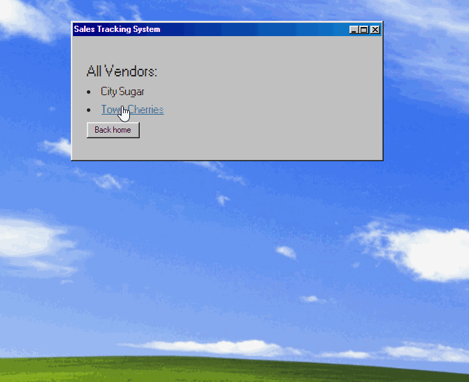

# OrderTrackingApp

#### C# web application to keep an eye on a busy bakery sales, by tracking vendors and their orders. Uses Entity Framework and MySql server for data persistency.

#### By Roman Kolivashko

## Quick look

## Technologies Used:

* C#
* .Net
* MSTest
* HTML
* CSS
* Razor

## Description
This is an MVC application that helps backery owner track the vendors that purchase baked goods from him and the orders belonging to those vendors.

* For example, the bakery might supply croissants to a vendor called "Suzie's Cafe" once a week. Pierre may want to create a new Vendor to represent the cafe and add new Orders to it to help keep track of his expanding business relationships.

<html>

 Note: this app was styled with CSS only, to provide Windows legacy UI look, no forms were imported from .Net

</html>

## Setup/Installation Requirements

* _Clone this repository_ `git clone https://github.com/romankolivashko/OrderTrackingApp.git`
* _Navigate to the root `/VendorTracker.Solution/VendorTracker` directory_
* _Run `dotnet restore` command to download required dependencies_
* _Run `dotnet run` command to launch the application in a console_

## Test setup/Installation Requirements

* _Navigate to the root `/VendorTracker.Solution/VendorTracker.Tests` directory_
* _Run `dotnet restore` command to download required MSTest dependencies_
* _Run `dotnet test` command to run the test_

## Known Bugs

* Refer to [the GitHub issues page](https://github.com/romankolivashko/OrderTrackingApp/issues) to see existing bugs or report new ones. 

## License
MIT
## Contact Information
rkolivashko@gmail.com